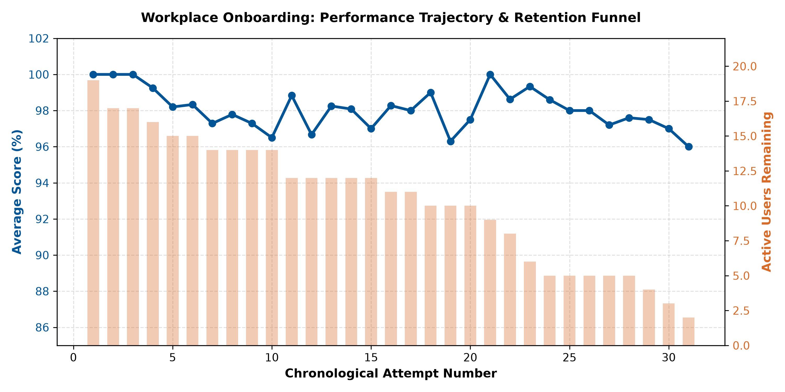
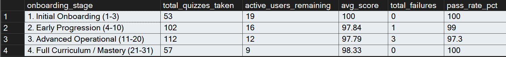

# Enterprise Training & Onboarding Progression Analysis
**Tech Stack:** Microsoft SQL Server, T-SQL, SQL Server Management Studio (SSMS), Python, Git  
**Focus Areas:** Relational Data Modeling, Window Functions, Funnel Attrition, Curriculum Auditing  

---

## Business Context
This project evaluates employee comprehension and onboarding progression across 320+ assessment records from an internal workplace training platform. Using T-SQL window functions, Common Table Expressions (CTEs), and attempt-based classification in SQL Server Management Studio (SSMS), the analysis models performance trajectories across sequential quiz attempts, isolates curriculum friction points, and measures drop-off across department onboarding tracks.

---

## Key Performance Findings

| Onboarding Stage | Attempt Range | Quizzes Taken | Active Staff | Avg Score | Pass Rate | Platform Failures |
| :--- | :--- | :--- | :--- | :--- | :--- | :--- |
| **1. Baseline Onboarding** | Attempts 1–3 | 53 | 19 | **100.0%** | 100.0% | 0 |
| **2. Early Progression** | Attempts 4–10 | 102 | 16 | **97.8%** | 99.0% | 1 |
| **3. Advanced Operational** | Attempts 11–20 | 112 | 12 | **97.8%** | 97.3% | 3 |
| **4. Curriculum Mastery** | Attempts 21–31 | 57 | 9 | **98.3%** | 100.0% | 0 |

* **Operational Friction Zone (Attempts 10–19):** Average scores drop to platform lows (~96–97%), and **100% of recorded platform failures** cluster within this window. Specific procedure bottlenecks include `finding-pos-gms-201` (75% score), `degree-colors-meanings` (84%), and `finding-special-order` (88%).
* **Funnel Attrition:** Engagement declines significantly after foundational training. While 19 staff members completed baseline safety, only 12 reached Attempt 15, and only 9 completed Attempt 21 (**52.6% total drop-off**).
* **Selection Bias in Scoring ($r = -0.39$):** Staff with fewer completed quizzes exhibited higher average scores because they only took introductory compliance material. Staff completing 20+ quizzes tackled specialized, error-prone operational procedures.

---

## Visualizations

### Performance Trajectory & User Retention


### SSMS Query Execution & Staging


---

## Database Architecture
The relational database was modeled in Microsoft SQL Server across structured lookup and fact tables:
* `profiles`: Employee master table tracking assigned roles, teams, and XP.
* `teams`: Department units (Warehouse, Merchandise, E-Tech, BOCO).
* `roles`: Access tiers (Student, Lead, Manager, Developer, Admin).
* `user_progress`: Fact table recording 324 individual quiz submissions (`score`, `passed`, `completed_at`).
* `quiz_map`: Mapping of granular assessments to broader operational modules.

---

## Core T-SQL Implementation

### 1. Attempt Sequencing & Running Averages
Calculates the chronological order of attempts per user and evaluates cumulative performance progression using window functions:

```sql
WITH user_attempt_history AS (
    SELECT 
        up.id AS progress_id,
        up.user_id,
        up.module_id,
        up.quiz_id,
        up.score,
        CASE 
            WHEN CAST(up.passed AS VARCHAR(10)) IN ('1', 'True', 'true') THEN 1 
            ELSE 0 
        END AS passed_flag,
        up.completed_at,
        ROW_NUMBER() OVER (
            PARTITION BY up.user_id 
            ORDER BY up.completed_at ASC
        ) AS attempt_number,
        ROUND(AVG(CAST(up.score AS FLOAT)) OVER (
            PARTITION BY up.user_id 
            ORDER BY up.completed_at ASC 
            ROWS BETWEEN UNBOUNDED PRECEDING AND CURRENT ROW
        ), 2) AS running_avg_score
    FROM user_progress_rows up
)
SELECT * FROM user_attempt_history;
```

### 2. Onboarding Stage Aggregation
Bins chronological attempts into operational milestones to benchmark completion volume, score averages, and failure distributions:
```sql
WITH user_attempt_history AS (
    SELECT 
        id AS progress_id,
        user_id,
        score,
        CASE 
            WHEN CAST(passed AS VARCHAR(10)) IN ('1', 'True', 'true') THEN 1 
            ELSE 0 
        END AS passed_flag,
        ROW_NUMBER() OVER (
            PARTITION BY user_id 
            ORDER BY completed_at ASC
        ) AS attempt_number
    FROM user_progress_rows
),
attempt_stage_classification AS (
    SELECT 
        progress_id,
        user_id,
        score,
        passed_flag,
        attempt_number,
        CASE 
            WHEN attempt_number BETWEEN 1 AND 3 THEN '1. Initial Onboarding (1-3)'
            WHEN attempt_number BETWEEN 4 AND 10 THEN '2. Early Progression (4-10)'
            WHEN attempt_number BETWEEN 11 AND 20 THEN '3. Advanced Operational (11-20)'
            ELSE '4. Full Curriculum / Mastery (21-31)'
        END AS onboarding_stage
    FROM user_attempt_history
)
SELECT 
    onboarding_stage,
    COUNT(progress_id) AS total_quizzes_taken,
    COUNT(DISTINCT user_id) AS active_users_remaining,
    ROUND(AVG(CAST(score AS FLOAT)), 2) AS avg_score,
    SUM(CASE WHEN passed_flag = 0 THEN 1 ELSE 0 END) AS total_failures,
    ROUND((CAST(SUM(passed_flag) AS FLOAT) / COUNT(progress_id)) * 100.0, 1) AS pass_rate_pct
FROM attempt_stage_classification
GROUP BY onboarding_stage
ORDER BY onboarding_stage ASC;
```
---

## Operational Recommendations
* **Targeted Curriculum Revisions:** Refactor procedural documentation for POS lookups and special orders to reduce the friction spike and error concentration observed between attempts 10 and 19.
* **Structured Supervisor Checkpoints:** Implement a formal check-in around Attempt 10 to support team members transitioning from basic store safety into complex multi-step systems.
* **Database Tracking Enhancements:** Transition logging to an append-only audit trail (`quiz_attempts`) capturing individual retake attempts and module duration (`time_spent_seconds`) to isolate pacing fatigue.

